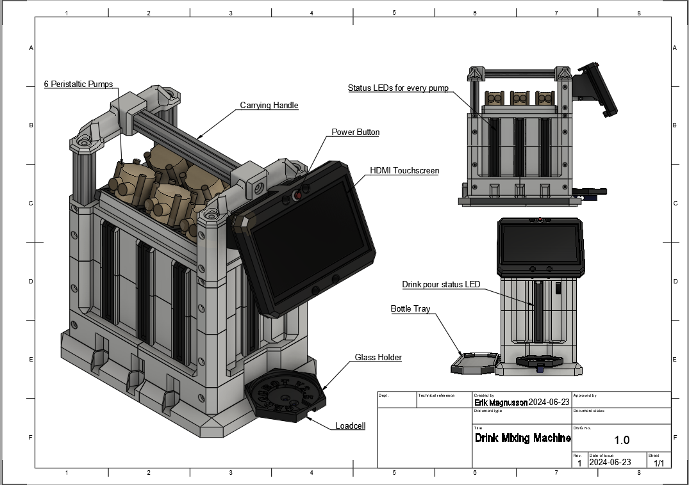
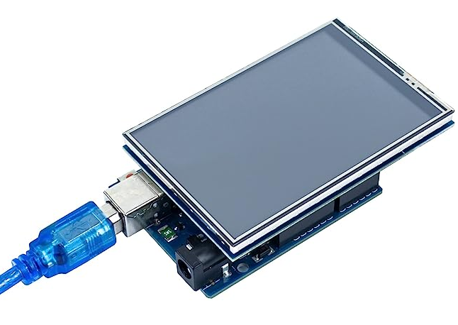

# automatic_drink_mixing_machine
Repository for an open source drink/cocktail mixing machine. Designed to be mainly 3D printed.

Software is currently implemented in dm_alpha_sw_01 branch. 

<!--  -->
 
Keywords: Cocktail, Mixing, Machine, Automatic, 3D printed, Drink, Pouring, Arduino, Pump, Liqour, spirits, Dispenser

# Capability and Functionality Walkthrough

 
 
 

The drinking machine has two startup and loading screens. The user may configure how big the glas he or she has to prevent overfilling. On the third image it shows how the joystick and buttons can be used to define how much liquid from each of the four pumps should be poured.

## Loading and Initialization
is a startup procedure with a graphical element to it. The user can configure what size of glas they are currently using. It also displays how many glases of drinks have been poured over the machine's lifetime.

## Main Screen
The main screen is where the user will spend most of his or hers time, it is here where one configures how much liquid will be dispensed from each pump. The GUI can be navigated using the joystick and two buttons.

### Pour Drink
Opens up a new window where the user will confirm that they want to start dispensing the drink. A progress bar GUI displays how much has been poured of set amounts. The machine will keep track of how many drinks have been poured in the machines lifetime by saving the amount to EEPROM memory.

### Randomize Drink
This is a party trick! This button randomizes the amount dispensed from each dispenser. 

### Settings

Here one can configure machine settings, such as;
* glas size
* loadcell (weight sensor) tuning parameters

# Repository Structure
@todo

# BOM
The Bill Of Materials for this project can be found below. 

## Components to Buy
| Image | Component | Function    | Quantity    | Where to buy |
| :---:   | :---: | :---: | :---: |  :---: |
|   | Arduino Mega 2560| Microcontroller and brains for the machine | 1 |   [Link](https://www.amazon.com/ARDUINO-MEGA-2560-REV3-A000067/dp/B0046AMGW0/ref=sr_1_1_sspa?keywords=arduino+mega&qid=1688582569&sr=8-1-spons&sp_csd=d2lkZ2V0TmFtZT1zcF9hdGY&psc=1) |
|   | 3.5 inch TFT lcd Arduino Shield| Visual Graphics User Interface 480x320 Pixels | 1 |   [Link](https://www.amazon.com/Hosyond-480X320-Display-Compatible-Mega2560/dp/B0B5ML6R5L/ref=sr_1_3?keywords=arduino+3.5+inch+tft+lcd+display+touch+screen+uno+r3+board+p&qid=1688582762&sprefix=tft+lcd+3.5%2Caps%2C178&sr=8-3) |
|   | 2 axis Joystick & button | Interfacing with GUI | 1 |   [Link](https://www.amazon.com/DIYables-Joystick-Arduino-ESP8266-Raspberry/dp/B0BPGRN48J/ref=sr_1_3?keywords=arduino+joystick&qid=1688582840&sprefix=arduino+joyst%2Caps%2C173&sr=8-3) |
|   | 4 Channel Relay Board | Switch Pumps ON and OFF | 1 |  [Link](https://www.amazon.com/HiLetgo-Channel-OPTO-Isolated-Support-Trigger/dp/B00LW2G7V6/ref=sr_1_1_sspa?keywords=4+channel+relay+module+12v&qid=1688582905&sprefix=relay+4+ch%2Caps%2C177&sr=8-1-spons&sp_csd=d2lkZ2V0TmFtZT1zcF9hdGY&psc=1) |
|   | Diaphram Pump | Pump liquid into glass | 4 |  [Link](https://www.amazon.com/Gikfun-Aquarium-Cooled-Diaphragm-EK1856/dp/B0744FWNFR/ref=sxin_17_pa_sp_search_thematic_sspa?content-id=amzn1.sym.749943ff-94bd-4679-8f03-3b5488f65fae%3Aamzn1.sym.749943ff-94bd-4679-8f03-3b5488f65fae&cv_ct_cx=12v+diaphragm+pump&keywords=12v+diaphragm+pump&pd_rd_i=B0744FWNFR&pd_rd_r=19751b0d-c8ad-42c9-bfed-f24ed475ad50&pd_rd_w=3Kpnu&pd_rd_wg=Ovpfx&pf_rd_p=749943ff-94bd-4679-8f03-3b5488f65fae&pf_rd_r=MY901Q6J3KKBB5CFV43T&qid=1688582971&sbo=RZvfv%2F%2FHxDF%2BO5021pAnSA%3D%3D&sprefix=12v+diap%2Caps%2C172&sr=1-4-2b34d040-5c83-4b7f-ba01-15975dfb8828-spons&sp_csd=d2lkZ2V0TmFtZT1zcF9zZWFyY2hfdGhlbWF0aWM&psc=1) |
|   | Silicone Tubing 10x8 mm | --- | 1 |  todo |
|   | Loadcell 5 Kg HX711 | Measure how much liquid has been dispensed for feedback | 1 |  [Link](https://www.amazon.com/Digital-Weighing-Arduino-Portable-Electronic/dp/B09K7G3477/ref=sr_1_1_sspa?crid=I0D8OYKD2RLQ&keywords=5kg+load+cell&qid=1688583078&sprefix=5kg+loadcel%2Caps%2C175&sr=8-1-spons&sp_csd=d2lkZ2V0TmFtZT1zcF9hdGY&psc=1) |
|   | LM2596 DC-DC converter | Convert PSU power to 12, 5 and 3.3V power rails | 3 |  [link](https://www.amazon.com/Regulator-Adjustable-Converter-Electronic-Stabilizer/dp/B07PDGG84B/ref=sr_1_3?keywords=lm2596+dc-dc+buck+converter&qid=1688583162&sprefix=lm25%2Caps%2C172&sr=8-3) |
|   | Buttons | Interfacing with GUI & Manual override of pumps | 3 |  [Link](https://www.amazon.com/WOWOONE-12x12x7-3-Tactile-Momentary-Assortment/dp/B08JLWTQ3C/ref=sr_1_1_sspa?crid=BQF6J5BHRU95&keywords=arduino+button&qid=1688583248&sprefix=arduino+butto%2Caps%2C171&sr=8-1-spons&sp_csd=d2lkZ2V0TmFtZT1zcF9hdGY&psc=1) |
|   | Power Supply Unit | Supplies Power to the machine, connects to an wall outlet | 1 |  todo |

## Components to 3D print
@todo

2kg PLA needed

# Assembly
@todo
